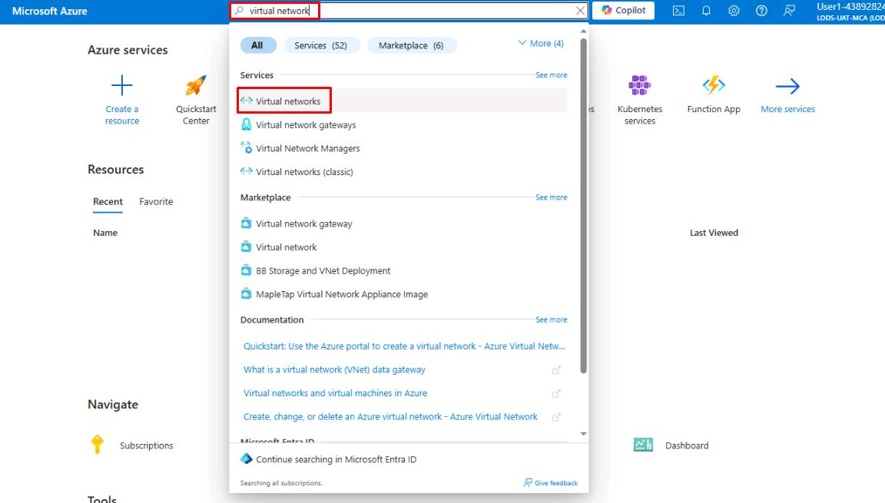
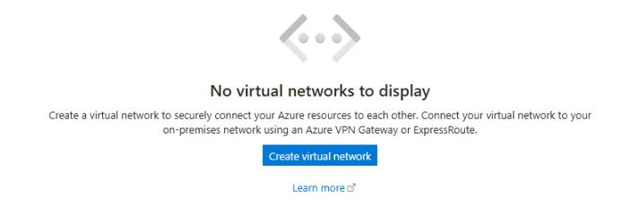
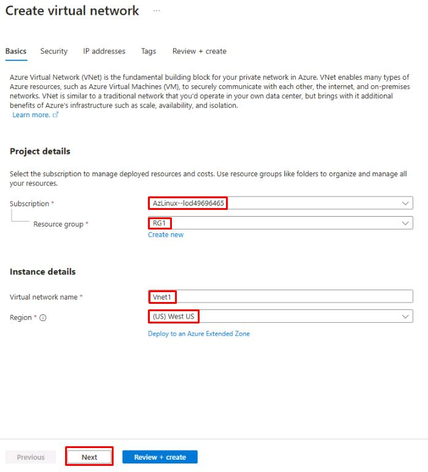
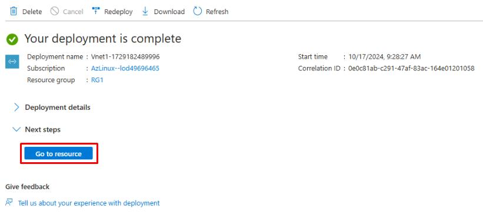
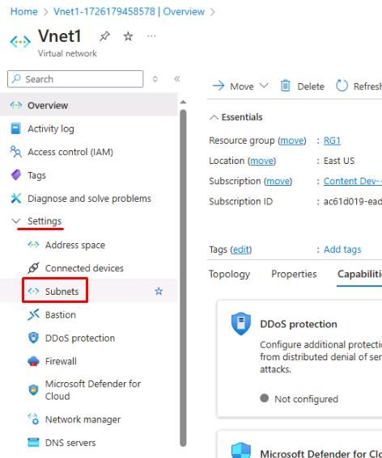
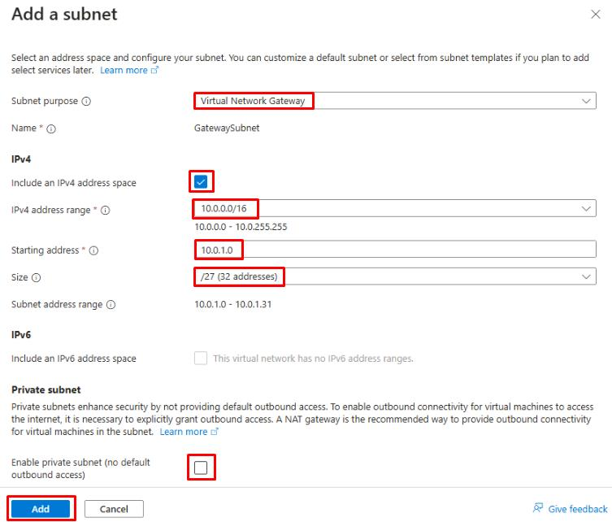

---
title: '01: Create a virtual network in Azure'  
layout: default
nav_order: 1
parent: 'Exercise 01: Create Azure resources'
--- 

### Task 1: Create a virtual network in Azure 

To securely host the PostgreSQL database, the City of Metropolis needs an isolated network environment. In this task, you'll create an Azure virtual network, which will serve as the destination for the migrated data, ensuring secure and efficient public service operations.

1. Connect to the virtual machine using the following credentials: 

    | Item | Value |
    |:--------|:--------|
    | Username   | **@lab.VirtualMachine(WindowsClientPostgreSQL16).Username**   |  
    | Password  | **@lab.VirtualMachine(WindowsClientPostgreSQL16).Password** |

1. Open Microsoft Edge and go to [Azure portal](https://portal.azure.com). Sign in with the following credentials: 

    | Item | Value |
    |:--------|:--------|
    | Username   | **@lab.CloudPortalCredential(User1).Username**   |
    | Password  | **@lab.CloudPortalCredential(User1).Password**   |

1. On the Portal home page, on the top global search bar, enter and select **`Virtual networks`**.  

     

1. At the bottom of the **Virtual Networks** page, select **Create virtual network**. 

     

1. On the **Create network** page, configure the **Basics** tab as follows: 

    | Item | Value | 
    |:---------|:---------| 
    | Subscription   | **TechMaster-lodxxxxxxxx** | 
    | Resource group   | **RG1**   | 
    | Virtual network name  |   **Vnet1**   |
    | Region    |   **(US) West US** |

    {: .warning } 
    > Confirm this resource is created in the **West US** region to ensure proper connectivity in later steps.

1. Select **Next** to continue. 

    

1. On the **Security** tab, leave all settings as default and select **Next**. 

1. On the **IP addresses** tab, leave all settings as default and select **Review + create**. 

    {: .important } 
    > The setup manager will automatically create an address space and a subnet for you. The default value is 10.0.0.0/16 for the network, and the default subnet is 10.0.0.0/24. These can be changed to whatever you wish, as long as the ranges don’t overlap. The default values will work for the purposes of this lab. 

1. Once the validation finishes, select **Create** to finish creating the virtual network. 

1. Once the deployment completes, select **Go to resource**. 

    

1. On the **Vnet1** page, select **Settings** on the service menu, then select **Subnets**. 

     

1. On the **Vnet1 | Subnets** page, select **+ Subnet**. 

1. Configure the **Add a subnet** blade as follows:  

    | Item | Value | 
    |:---------|:---------| 
    | Subnet purpose  | **Virtual Network Gateway** | 
    | IPv4 address range   | **10.0.0.0/16**   | 
    | Starting address |   **10.0.1.0**
    | Size    |   **/27 (32 addresses) **

1. Select **Add**. 

     

You've successfully completed this task! Select **Next** to continue. 

=== 
