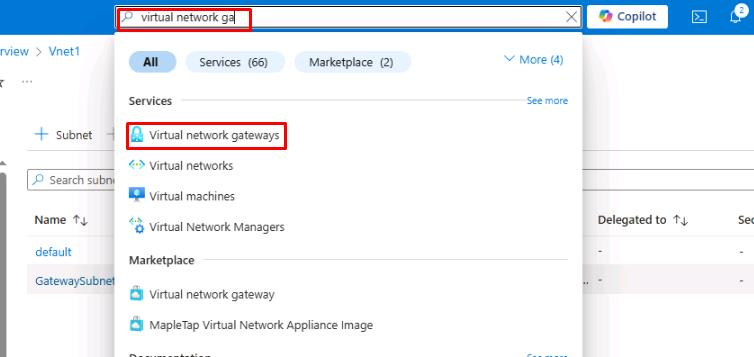
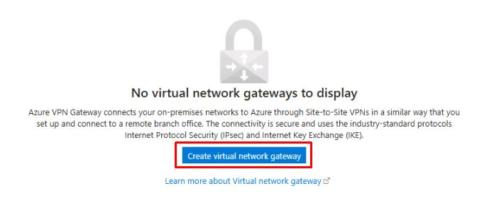
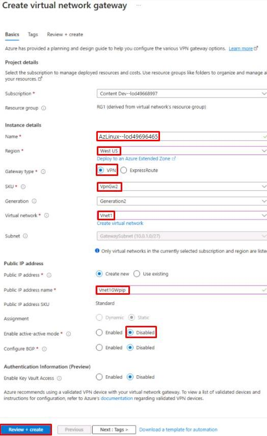

### Task 2: Create a virtual network gateway in Azure 

In this task, you'll set up a virtual network gateway to establish a secure connection between the on-premises PostgreSQL server and Azure. This ensures the city’s systems remain connected without compromising service.

1. From the Azure portal, on the top global search bar, enter and select **Virtual network gateways**. 

     

1. At the bottom of the **Virtual network gateways** page, select **Create virtual network gateway**. 

     

1. On the **Create virtual network gateway** page, configure the **Basics** tab as follows: 

    | Item | Value | 
    |:---------|:---------| 
    | Subscription  | **TechMaster-lodxxxxxxxx** | 
    | Name   | **Vnet1GW**   | 
    | Region |   **West US**   | 
    | Gateway type    |   **VPN**   | 
    | SKU  | **VpnGw2** | 
    | Generation   | **Generation2**   | 
    | Virtual network |   **Vnet1** | 
    | Public IP address name    |   **Vnet1GWpip**  | 
    | Enable active-active mode  |    **Disabled** | 

    {: .warning } 
    > Confirm this resource is created in the **West US** region to ensure proper connectivity in later steps.

    

1. Select **Review + create**, then select **Create**. 

    {: .note } 
    > This process may take around 15 minutes. You can proceed with the following task as this deploys.

1. Minimize Edge. You’ll return to it in another task. 

You've successfully completed this task! Select **Next** to continue. 
