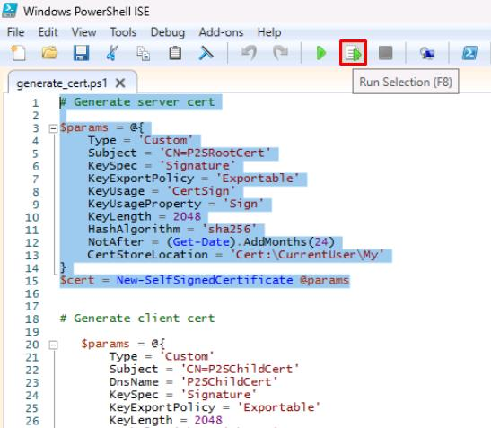
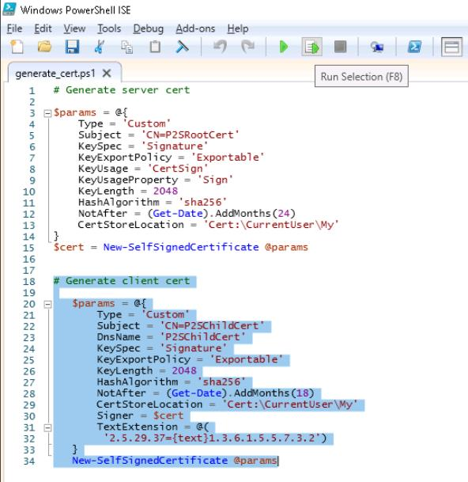
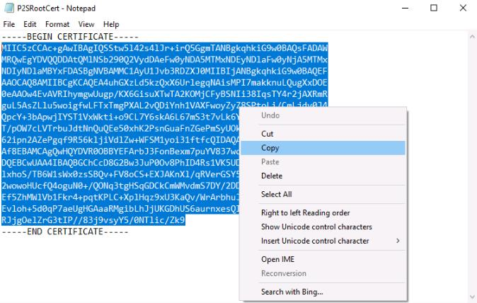

### Task 3: Generate certificates 

To safeguard sensitive administrative data during migration, the City of Metropolis implements strong security protocols. 

In this task, you'll generate a server certificate and client certificate on the source server, essential for establishing a secure VPN connection to Azure.

1. On the VM, open Windows File Explorer and go to **C:\LabFiles**. 

1. Right-click **generate_cert.ps1** and select **Edit**. 

1. Once the file opens in PowerShell ISE, select the top portion of the script, then select the **Run Selection** button at the top. 

    

1. Select the bottom portion of the script, then select **Run Selection**. 

    

    {: .note } 
    > These two scripts are generating the server and client certificates, respectively. 

1. In the Windows search bar at the lower left, enter **Manage user certificates**. 

    {:.note } 
    > When asked for an administrator password, use **@lab.VirtualMachine(WindowsClientPostgreSQL16).Password** 

1. From the certificate manager, on the left menu, expand **Personal** and then select **Certificates**. 

1. Right-click the **P2SRootCert**, select **All Tasks**, then select **Export**. 

1. In the **Certificate Export** wizard, select **Next**.
 
1. Leave **No, do not export the private key** selected and select **Next**. 

1. Choose **Base-64 encoded X.509 (.CER)** and select **Next**. 

1. On the **File to Export** step, select **Browse**, go to **C:\LabFiles**, enter **P2SRootCert** for **File name**, then select **Save**.

1. Once the file name is selected, select **Next**, then select **Finish**. 

1. Once exported, go to **C:\LabFiles** in Windows File Explorer. 

1. Right-click the **P2SRootCert** file and select **Open with**, select **Notepad**, then select **OK**.

1. Once the file opens in Notepad, select and copy all the lines between **-----BEGIN CERTIFICATE-----** and **-----END CERTIFICATE-----**. 

     

You've successfully completed this task! Select **Next** to continue. 
