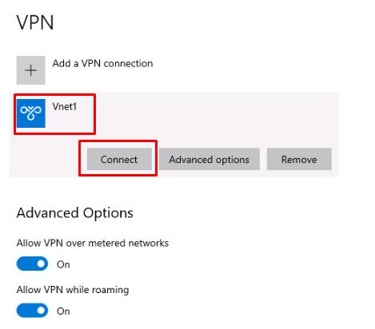

### Task 4: Create Azure Point-to-site connection and install VPN client 

In this task, you will configure a Point-to-site connection in Azure and install the VPN client on the source server. This step enables encrypted data transfer, addressing integration and security considerations.

1. From the desktop, switch to Edge with the Microsoft Portal. 

1. Check the deployment status of the virtual network gateway. When complete, select **Go to resource**. 

    {: .warning } 
    > Wait until the gateway is deployed before continuing. 

1. On the **Vnet1GW** page, select **Settings** from the left service menu, and then select **Point-to-site configuration**. 

1. Select **Configure now**. 

1. Configure the **Vnet1GW - Point-to-site configuration** page as follows: 

    | Item | Value | 
    |:---------|:---------| 
    | Address pool  | **172.16.201.0/24** | 
    | Tunnel type   | **IKEv2 and OpenVPN (SSL)**   | 
    | Authentication type |   **Azure certificate** | 
    | Name (Root certificates)    |   **RootCertificate**   | 
    | Public certificate data (Root certificates)    |   {Paste the string copied in the previous task into the same row as **RootCertificate**}   | 

1. Select **Save** at the top when finished. 

     

1. From the **Vnet1GW | Point-to-site configuration** page, select **Download VPN client** at the top. 

    {: .warning } 
    > You'll need to wait until the configuration saves, which will take a couple minutes. Once you see **Saved virtual network gateway** in the upper right, you'll be able to download the VPN client file. 

     

1. Once the download completes, open Windows File Explorer and go to the **Downloads** folder. 

1. Right-click **Vnet1GW.zip** and select **Extract All**, then select **Extract**. 

1. From the **Vnet1GW** folder, open the **WindowsAmd64** folder. 

1. Right-click **VpnClientSetupAmd64** and select **Run as administrator**. 

     

    {: .warning } 
    > A warning will show stating that the app is unrecognized. Select **More info** and then select **Run anyway**.  

1. At the User Account Control prompt, enter **@lab.VirtualMachine(WindowsClientPostgreSQL16).Password** and select **Yes**. 

1. Select **Yes** to finish installing the VPN client. 

1. Once the installation is finished, select the network icon in the notification area and then select the **Vnet1** connection. 

     

1. From the VPN settings, select **Vnet1** and then select **Connect**. 

     

1. A separate **Vnet1** connection window will open in the background. Switch to it and select **Connect**. 

    {: .note } 
    > A Window may show asking about privilege escalation, select **Continue**. 

     

1. At the User Account Control prompt, enter **@lab.VirtualMachine(WindowsClientPostgreSQL16).Password**, then select **Yes**. 

1. Verify that **Vnet1** is connected successfully. The word "Connected" should show under the **Vnet1** connection. 

     

You've successfully completed this task! Select **Next** to continue. 
