# Task 01: Prepare the environment

## Introduction

Establishing a Managed Instance link is crucial for Adatum Corporation to ensure high availability and disaster recovery for their eBook store, Adatum Books. This process involves creating an Azure SQL Managed Instance and verifying the deployment of an Azure SQL VM to enable replication between the on-premises SQL VM and the Azure SQL Managed Instance. This setup is essential for maintaining business continuity and preventing disruptions to their eBook shopping services.

## Description

In this task, you'll set up the environment for a Managed Instance link, enabling replication between SQL Server (on Windows or Linux) and an Azure SQL Managed Instance. You'll create an Azure SQL Managed Instance, verify the deployment of an Azure SQL VM, and access the virtual machine to configure SQL Server settings.

## Success criteria

-   You successfully created an Azure SQL Managed Instance.
-   You verified the deployment of an Azure SQL VM.
-   You accessed the virtual machine and configured SQL Server settings.
-   You enabled replication between the on-premises SQL VM and the Azure SQL Managed Instance.
-   You ensured the setup supported high availability and disaster recovery for Adatum Corporation's eBook store, Adatum Books.

## Learning resources

-   [Prepare your environment for a link - Azure SQL Managed Instance](https://learn.microsoft.com/en-us/azure/azure-sql/managed-instance/managed-instance-link-preparation?view=azuresql)
-   [Create an Azure SQL Managed Instance](https://learn.microsoft.com/en-us/azure/azure-sql/managed-instance/instance-create-quickstart?view=azuresql)
-   [Verify the deployment of an Azure SQL VM](https://learn.microsoft.com/en-us/shows/azure-sql-for-beginners/deploy-and-verify-azure-sql-13-of-61)
-   [SQL Server Configuration Manager](https://learn.microsoft.com/en-us/sql/relational-databases/sql-server-configuration-manager?view=sql-server-ver16)

===

## 01: Create the target SQL managed instance

1. Open Microsoft Edge, go to `https://portal.azure.com`, then sign in with your lab credentials:

    | Item | Value |
    |:--------|:--------|
    | Username   | `@lab.CloudPortalCredential(User1).Username`   |
    | Password  | `@lab.CloudPortalCredential(User1).Password`   |

1. In the top global search bar, enter and select **`Azure SQL`**.

    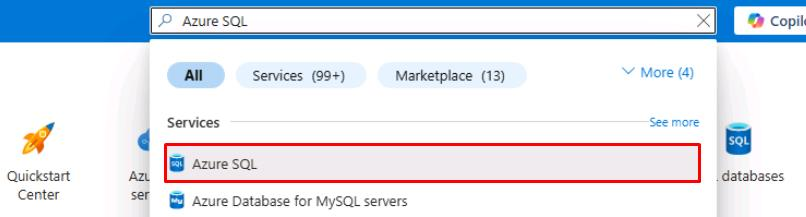

1. Select **Create** on the top command bar.

    

1. Under **SQL managed instances**, select **Create**.

    

1. In the **Want to try SQL MI for free?** banner, select **Apply free offer** to use the free trial.

    

1. Use the following information to fill out the **Basics** tab:

    | Item | Value |
    | --- | --- |
    | Resource group | **`@lab.CloudResourceGroup(ResourceGroup1).Name`** |
    | Region | **@lab.CloudResourceGroup(ResourceGroup1).Location** |
    | Authentication method | **Use SQL authentication** |
    | Managed instance admin login | **`MILab`** |
    | Password | **`@lab.Variable(azurePw)`** |

    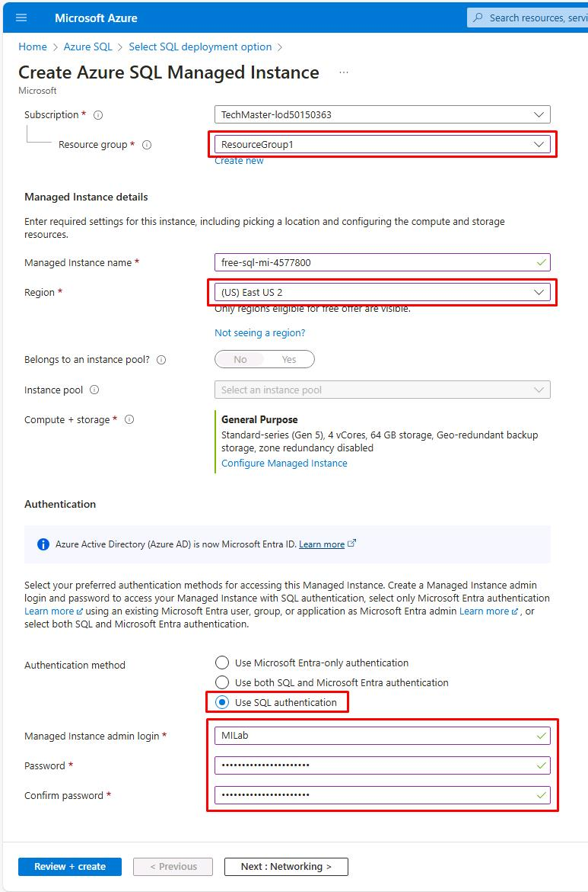

    {: .highlight }
    > | Region Code | Portal UI |
    > | --- | --- |
    > | eastus | (US) East US |
    > | eastus2 | (US) East US 2 |
    > | southcentralus | (US) South Central US |
    > | westus2 | (US) West US 2 |

1. Select **Next: Networking >** at the bottom.

1. Select the **Virtual network / subnet** dropdown, then select the existing subnet: **SQLMI-VNET/ManagedInstanceSubnet**.

    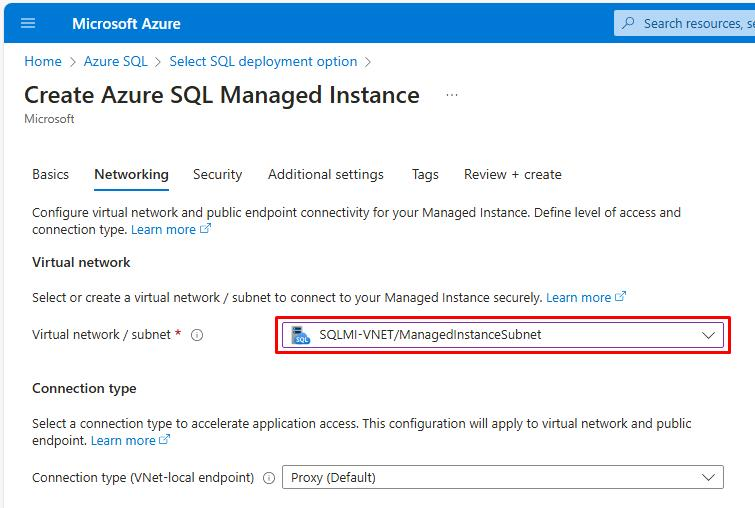

    {: .note }
    > You're using the same virtual network as the VM that'll be the primary replica for the SQL database.

1. Next to **Public endpoint (data)**, select **Disable**.

    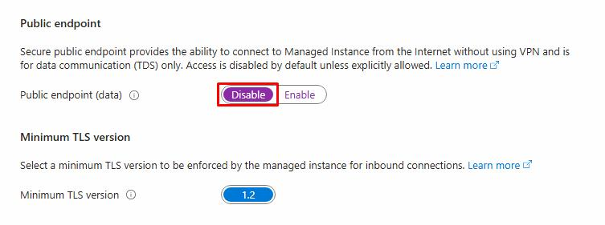

1. Select **Review + create** at the bottom to review the settings, but **do not create**.

    {: .warning }
    > Do not create. A Managed Instance with these configurations is already being deployed. 

    {: .important }
    > A Managed Instance may take up to 6 hours to deploy, unless it meets the various requirements for [fast provisioning](https://learn.microsoft.com/en-us/azure/azure-sql/managed-instance/management-operations-overview?view=azuresql#fast-provisioning), which can take under 30 minutes.

===

## 02: Verify the Azure SQL VM deployment

At the start of this lab, an Azure VM with the resources you'll need for this exercise, began deployment. You'll need to verify its completion.

1. In the same tab, expand the portal menu by selecting the menu icon in the upper left, then select **Resource Groups**.

    

1. Select **OK** to discard the unsaved edits.

1. Select **@lab.CloudResourceGroup(ResourceGroup1).Name**.

1. Next to **Deployments**, if it still shows **1 Deploying**, select it.

    

1. Select the numbers listed under **Deployment name**.

    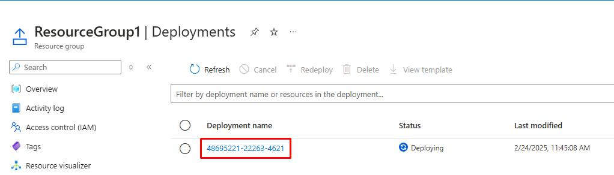

1. Under the **Resource** column, wait until **SQLVM1/CustomScriptExtension** shows a checkmark.

    

    {: .warning }
    > This may take 5-10 minutes to complete. You do **not** need to wait for the **SQL managed instance** deployment at this time. You’ll return to this tab at a later step to verify completion.

===

## 03: Access the Azure SQL VM

1. In the upper left, right-click the **ResourceGroup1 | Deployments** breadcrumb link, then select **Open link in new tab** to go to **@lab.CloudResourceGroup(ResourceGroup1).Name**.

    

1. Under your **Resources**, copy and paste the name of your **SQL managed instance** in the text box below. 

    It will be formatted **free-sql-mi-[random]**. This value will continue to be referenced throughout this lab.

    @lab.TextBox(miName)

    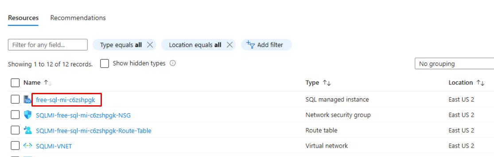

    {: .note } Do not enter the value from the screenshot.

1. Select the **SQLVM1** Virtual machine.

    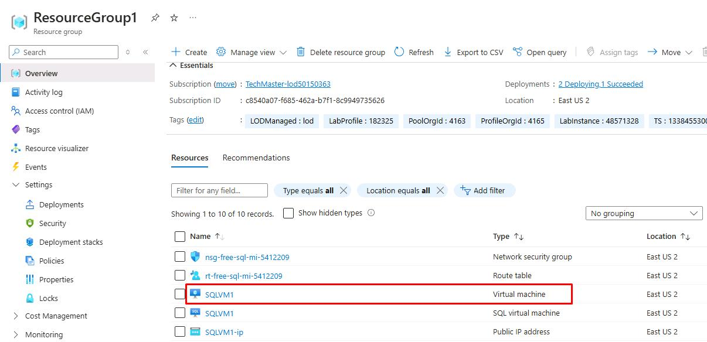

    {: .note } This is a Windows Server 2019 VM with SQL Server 2019.

1. On the left service menu, select **Connect**, then select **Connect**.

    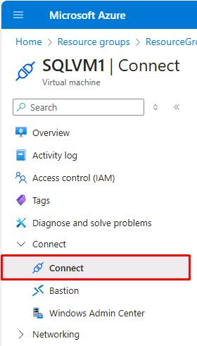

1. In the **Native RDP** tile, select **Download RDP file**.

    

1. Select the file from the Edge **Downloads** to open. You can access it again from the Windows 11 **Downloads** folder.

    

1. Select the checkbox for **Don't ask me again...**, then select **Connect**.

    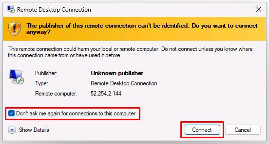

1. Enter the Azure VM credentials, then select **OK** to connect.

    | Item | Value |
    |:--------|:--------|
    | Username   | **VMLab**   |
    | Password  | **`@lab.Variable(azurePw)`**   |

1. On the warning dialog, select the **Don't ask me again...** checkbox, and select **Yes**.

    

===

## 04: Create a database master key

You'll need to create a database master key as part of the requirements to setup the Managed Instance link.

1. On the **SQLVM1** desktop, open SQL Server Management Studio.

    

1. Select the **Trust server certificate** checkbox, then select **Connect**.

    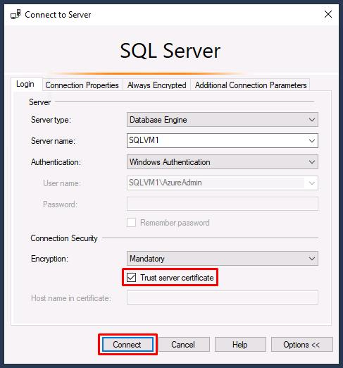

1. Select **New Query** on the toolbar.

    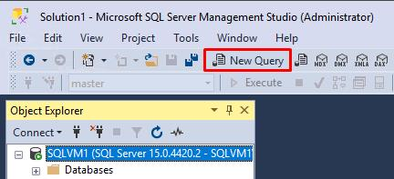

1. Create a database master key in the master database by pasting the following query:

    ```
    -- Run on SQL Server
    -- Create a master key
    USE master;
    GO
    CREATE MASTER KEY ENCRYPTION BY PASSWORD = '@lab.VirtualMachine(Workstation1).Password';
    ```

    {: .note } Selecting **Copy** on these code blocks and pasting will be much quicker than using **Type**.

1. Select **Execute** on the top toolbar.

    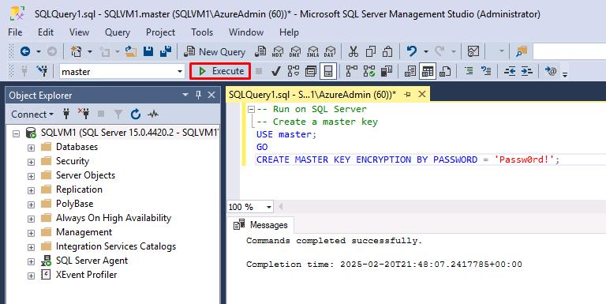

===

## 05: Enable availability groups

The Managed Instance link relies on the Always On Availability Groups feature of SQL Server, which is disabled by default. 

{: .important } For more information, see [Enable the Always On availability groups feature](https://learn.microsoft.com/en-us/sql/database-engine/availability-groups/windows/enable-and-disable-always-on-availability-groups-sql-server?view=sql-server-ver16).

1. Select the Windows start menu, then enter and select **`SQL Server 2019 Configuration Manager`**.

    

1. On the left menu, select **SQL Server Services**.

1. Right-click **SQL Server (MSSQLSERVER)**, then select **Properties**.

    

1. Select the **Always On Availability Groups** tab.

1. Select the **Enable Always On Availability Groups** checkbox, then select **Apply**.

    

1. Select **OK** on the **Warning** dialog. Keep the **Properties** window open.

===

## 06: Enable startup trace flags

To optimize the performance of your link, it's recommended to enable the following trace flags at startup:

- **-T1800**: This trace flag optimizes performance when the log files for the primary and secondary replicas in an availability group are hosted on disks with different sector sizes, such as 512 bytes and 4 KB. If both primary and secondary replicas have a disk sector size of 4 KB, this trace flag isn't required. 
    
    {: .important } For more information, see [KB3009974](https://support.microsoft.com/en-us/topic/kb3009974-fix-slow-synchronization-when-disks-have-different-sector-sizes-for-primary-and-secondary-replica-log-files-in-sql-server-ag-and-logshipping-environments-ed181bf3-ce80-b6d0-f268-34135711043c).

- **-T9567**: This trace flag enables compression of the data stream for availability groups during automatic seeding. The compression increases the load on the processor but can significantly reduce transfer time during seeding.

---

1. Select the **Startup Parameters** tab.

1. Enter `-T1800`, then select **Add**.

1. Enter `-T9567`, then select **Add**.

    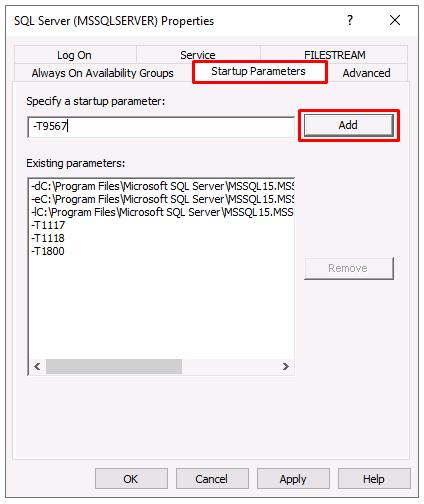

1. Select **OK**, then select **OK** on the **Warning** dialog.

1. Restart SQL Server by right-clicking **SQL Server (MSSQLSERVER)**, then select **Restart**.

    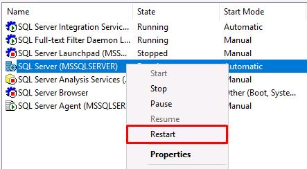

{: .important } For more information, see the [syntax to enable trace flags](https://learn.microsoft.com/en-us/sql/t-sql/database-console-commands/dbcc-traceon-transact-sql?view=sql-server-ver16).

===

## 07: Validate the configuration

1. Go back to your open **SQL Server Management Studio** window.

1. Replace your previous query for setting the master key with the following:

    ```
    -- Shows if the Always On availability groups feature is enabled
    SELECT SERVERPROPERTY ('IsHadrEnabled') as 'Always On enabled (1 true, 0 false)';
    GO
    -- Lists all trace flags enabled on SQL Server
    DBCC TRACESTATUS;
    ```

1. Select **Execute** on the top toolbar.

    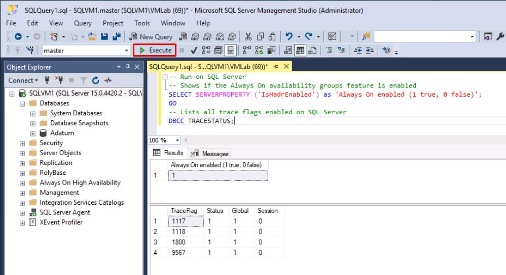

    {: .note } **Always On enabled** should be **1**.
    > 
    >**1800** and **9567** should be listed.
    >
    > If not, restart SQL Server again from SQL Server Configuration Manager.

---

**Congratulations!** You've successfully completed this task.
