# Exercise 02: Create and manage an SQL Managed Instance in Azure

## Scenario

Adatum Corporation is a national retail chain headquartered in Atlanta, GA, with 1,500 stores across the United States. The company is dedicated to leveraging cutting-edge technology and AI-driven tools to improve customer interactions and streamline operations. Adatum Corporation recently launched an eBook store, Adatum Books. They are currently using an on-premises SQL VM to store their data and application. Concerned about business continuity and potential disruptions to their eBook shopping services, they seek to implement a solution that ensures high availability and disaster recovery.

This exercise is designed to provide you with hands-on experience in setting up and managing an SQL Managed Instance in Azure. Throughout this exercise, you'll explore various aspects of SQL Managed Instance, including its configuration, network connectivity, and data replication.

You'll work with Azure SQL Managed Instance, a fully managed SQL Server database engine that provides built-in high availability, automated backups, and scaling capabilities; SQL Server on Azure Virtual Machines (VMs), which offers full control over the SQL Server environment and integration with other Azure services; and SQL Server Management Studio (SSMS), a powerful tool for managing SQL Server instances, databases, and their components.

By the end of this exercise, you'll have a comprehensive understanding of how to set up, configure, and manage an SQL Managed Instance in Azure. You'll also gain practical experience in ensuring network connectivity, replicating data, and performing failovers, which are essential skills for managing SQL databases in a cloud environment.

## Objectives

After you complete this exercise, you'll be able to:

-   Set up, configure, and manage a SQL Managed Instance in Azure.
-   Replicate data between SQL Server and Azure SQL Managed Instance.
-   Perform failovers, ensuring high availability and disaster recovery.

## Duration

**Estimated time:** 60 minutes

# Sign to the lab VM

Before you begin, sign in to the VM environment you'll use for the duration of this lab.

- Sign in to the machine using the credentials provided here.

    | Item | Value |
    | --- | --- |
    | Username | +++@lab.VirtualMachine(Workstation1).Username+++ |
    | Password | +++@lab.VirtualMachine(Workstation1).Password+++ |

# Task 01: Prepare the environment

## Introduction

Establishing a Managed Instance link is crucial for Adatum Corporation to ensure high availability and disaster recovery for their eBook store, Adatum Books. This process involves creating an Azure SQL Managed Instance and verifying the deployment of an Azure SQL VM to enable replication between the on-premises SQL VM and the Azure SQL Managed Instance. This setup is essential for maintaining business continuity and preventing disruptions to their eBook shopping services.

## Description

In this task, you'll set up the environment for a Managed Instance link, enabling replication between SQL Server (on Windows or Linux) and an Azure SQL Managed Instance. You'll create an Azure SQL Managed Instance, verify the deployment of an Azure SQL VM, and access the virtual machine to configure SQL Server settings.

## Success criteria

-   You successfully created an Azure SQL Managed Instance.
-   You verified the deployment of an Azure SQL VM.
-   You accessed the virtual machine and configured SQL Server settings.
-   You enabled replication between the on-premises SQL VM and the Azure SQL Managed Instance.
-   You ensured the setup supported high availability and disaster recovery for Adatum Corporation's eBook store, Adatum Books.

## Learning resources

-   [Prepare your environment for a link - Azure SQL Managed Instance](https://learn.microsoft.com/en-us/azure/azure-sql/managed-instance/managed-instance-link-preparation?view=azuresql)
-   [Create an Azure SQL Managed Instance](https://learn.microsoft.com/en-us/azure/azure-sql/managed-instance/instance-create-quickstart?view=azuresql)
-   [Verify the deployment of an Azure SQL VM](https://learn.microsoft.com/en-us/shows/azure-sql-for-beginners/deploy-and-verify-azure-sql-13-of-61)
-   [SQL Server Configuration Manager](https://learn.microsoft.com/en-us/sql/relational-databases/sql-server-configuration-manager?view=sql-server-ver16)


## 01: Create the target SQL managed instance

1. Open Microsoft Edge, go to `https://portal.azure.com`, then sign in with your lab credentials:

    | Item | Value |
    |:--------|:--------|
    | Username   | `@lab.CloudPortalCredential(User1).Username`   |
    | Password  | `@lab.CloudPortalCredential(User1).Password`   |

1. In the top global search bar, enter and select **`Azure SQL`**.

    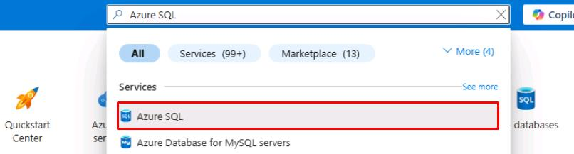

1. Select **Create** on the top command bar.

    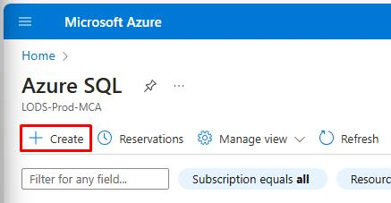

1. Under **SQL managed instances**, select **Create**.

    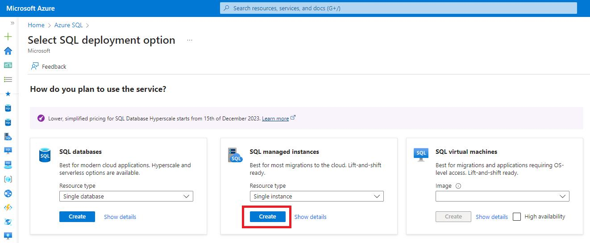

1. In the **Want to try SQL MI for free?** banner, select **Apply free offer** to use the free trial.

    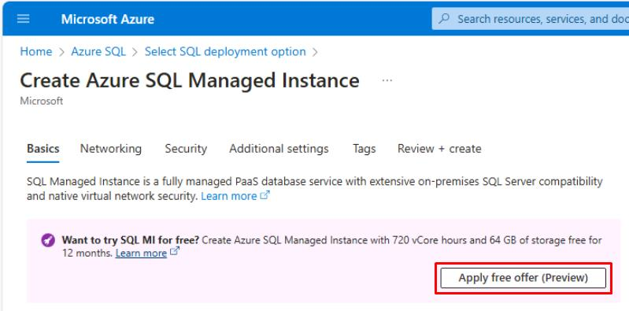

1. Use the following information to fill out the **Basics** tab: 

    | Item | Value |
    | --- | --- |
    | Resource group | **`@lab.CloudResourceGroup(ResourceGroup1).Name`** |
    | Region | **@lab.CloudResourceGroup(ResourceGroup1).Location** |
    | Authentication method | **Use SQL authentication** |
    | Managed instance admin login | **`MILab`** |
    | Password | **`@lab.Variable(azurePw)`** |

    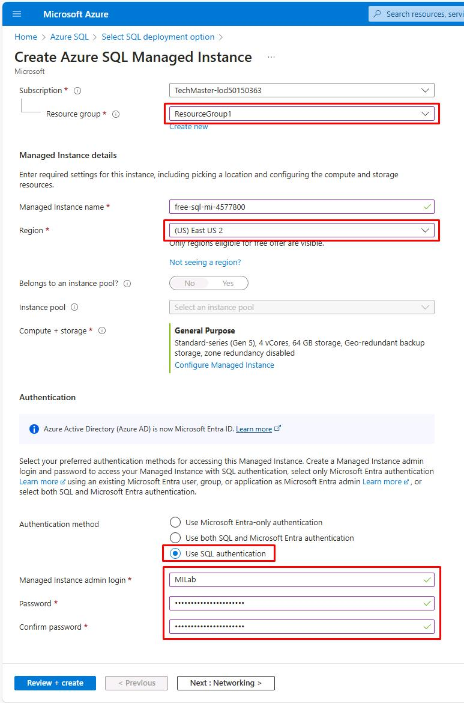

    {: .highlight }
    >
    > | Region Code | Portal UI |
    > | --- | --- |
    > | eastus | (US) East US |
    > | eastus2 | (US) East US 2 |
    > | southcentralus | (US) South Central US |
    > | westus2 | (US) West US 2 |

1. Select **Next: Networking >** at the bottom.

1. Select the **Virtual network / subnet** dropdown, then select the existing subnet: **SQLMI-VNET/ManagedInstanceSubnet**.

    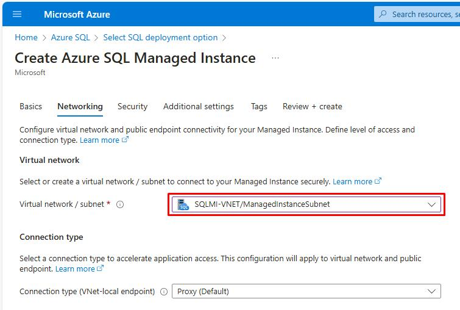

    {: .note }
    > You're using the same virtual network as the VM that'll be the primary replica for the SQL database.

1. Next to **Public endpoint (data)**, select **Disable**.

    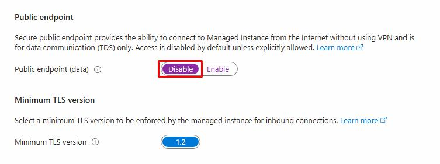

1. Select **Review + create** at the bottom to review the settings, but **do not create**.

    {: .warning }
    > 


    > Do not create. A Managed Instance with these configurations is already being deployed. 

    {: .important }
    > A Managed Instance may take up to 6 hours to deploy, unless it meets the various requirements for [fast provisioning](https://learn.microsoft.com/en-us/azure/azure-sql/managed-instance/management-operations-overview?view=azuresql#fast-provisioning), which can take under 30 minutes.


## 02: Verify the Azure SQL VM deployment

At the start of this lab, an Azure VM with the resources you'll need for this exercise, began deployment. You'll need to verify its completion.

1. In the same tab, expand the portal menu by selecting the menu icon in the upper left, then select **Resource Groups**.

    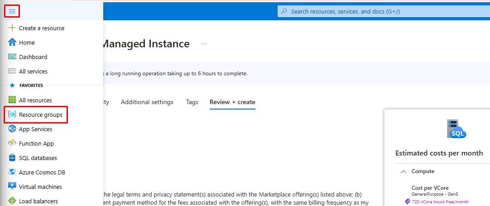

1. Select **OK** to discard the unsaved edits.

1. Select **@lab.CloudResourceGroup(ResourceGroup1).Name**.

1. Next to **Deployments**, if it still shows **1 Deploying**, select it.

    

1. Select the numbers listed under **Deployment name**.

    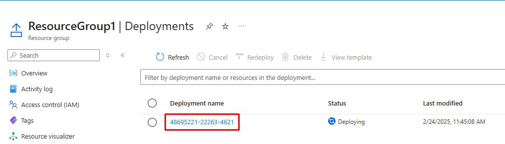

1. Under the **Resource** column, wait until **SQLVM1/CustomScriptExtension** shows a checkmark.

    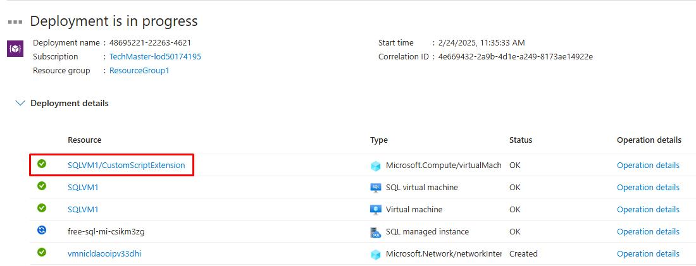

    {: .warning }
    > This may take 5-10 minutes to complete. You do **not** need to wait for the **SQL managed instance** deployment at this time. You’ll return to this tab at a later step to verify completion.


## 03: Access the Azure SQL VM

1. In the upper left, right-click the **ResourceGroup1 > Deployments** breadcrumb link, then select **Open link in new tab** to go to **@lab.CloudResourceGroup(ResourceGroup1).Name**.

    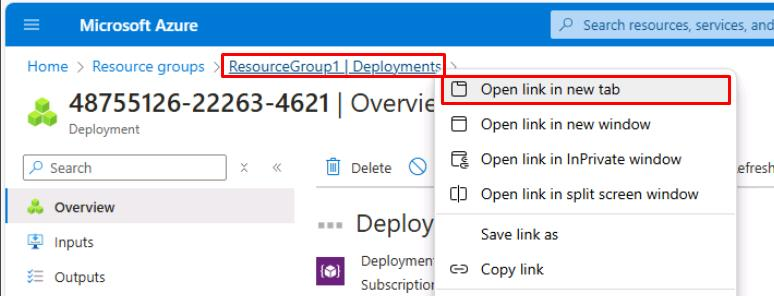

1. Under your **Resources**, copy and paste the name of your **SQL managed instance** in the text box below. 

    It will be formatted **free-sql-mi-[random]**. This value will continue to be referenced throughout this lab.

    @lab.TextBox(miName)

    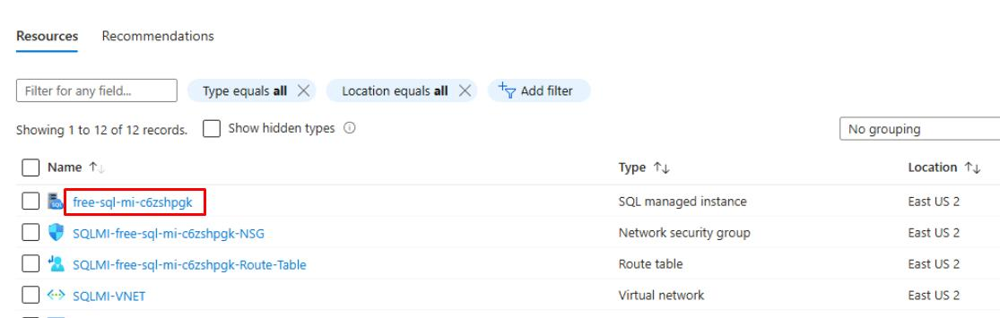

    {: .note }
    > Do not enter the value from the screenshot.

1. Select the **SQLVM1** Virtual machine.

    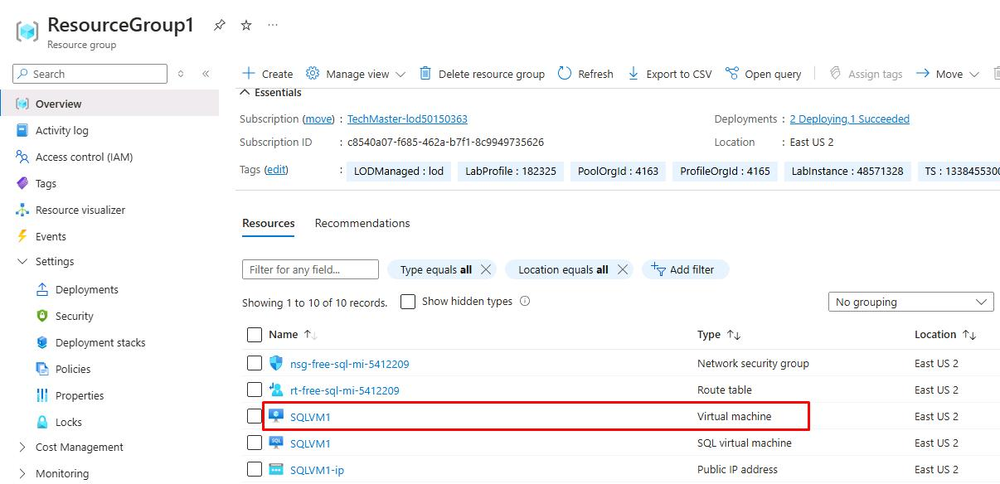

    {: .note }
    > This is a Windows Server 2019 VM with SQL Server 2019.

1. On the left service menu, select **Connect**, then select **Connect**.

    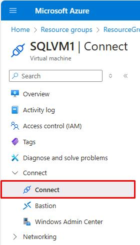

1. In the **Native RDP** tile, select **Download RDP file**.

    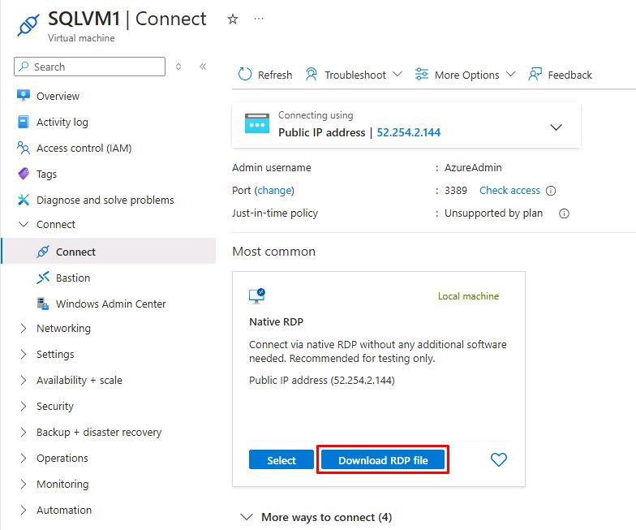

1. Select the file from the Edge **Downloads** to open. You can access it again from the Windows 11 **Downloads** folder.

    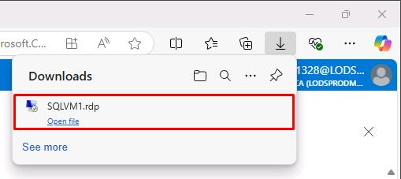

1. Select the checkbox for **Don't ask me again...**, then select **Connect**.

    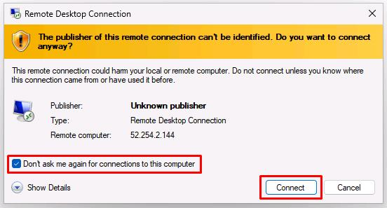

1. Enter the Azure VM credentials, then select **OK** to connect.

    | Item | Value |
    |:--------|:--------|
    | Username   | **VMLab**   |
    | Password  | **`@lab.Variable(azurePw)`**   |

1. On the warning dialog, select the **Don't ask me again...** checkbox, and select **Yes**.

    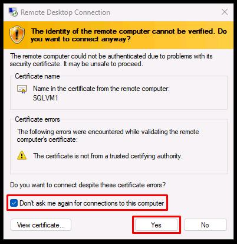


## 04: Create a database master key

You'll need to create a database master key as part of the requirements to setup the Managed Instance link.

1. On the **SQLVM1** desktop, open SQL Server Management Studio.

    

1. Select the **Trust server certificate** checkbox, then select **Connect**.

    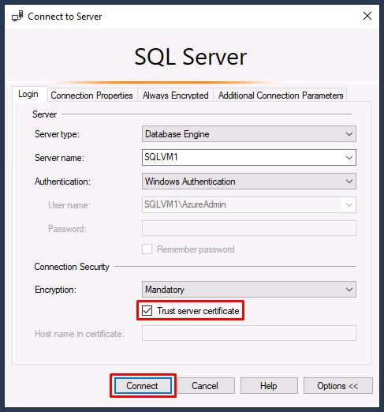

1. Select **New Query** on the toolbar.

    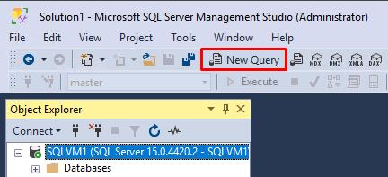

1. Create a database master key in the master database by pasting the following query:

    ```
    -- Run on SQL Server
    -- Create a master key
    USE master;
    GO
    CREATE MASTER KEY ENCRYPTION BY PASSWORD = '@lab.VirtualMachine(Workstation1).Password';
    ```

    {: .note }
    > Selecting **Copy** on these code blocks and pasting will be much quicker than using **Type**.

1. Select **Execute** on the top toolbar.

    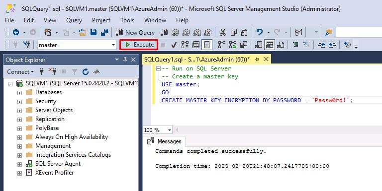


## 05: Enable availability groups

The Managed Instance link relies on the Always On Availability Groups feature of SQL Server, which is disabled by default. 

{: .important } 
> For more information, see [Enable the Always On availability groups feature](https://learn.microsoft.com/en-us/sql/database-engine/availability-groups/windows/enable-and-disable-always-on-availability-groups-sql-server?view=sql-server-ver16).

1. Select the Windows start menu, then enter and select **`SQL Server 2019 Configuration Manager`**.

    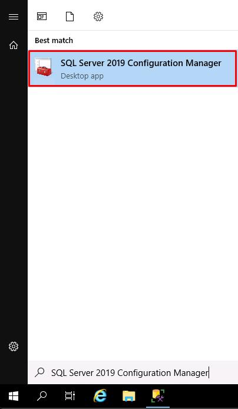

1. On the left menu, select **SQL Server Services**.

1. Right-click **SQL Server (MSSQLSERVER)**, then select **Properties**.

    

1. Select the **Always On Availability Groups** tab.

1. Select the **Enable Always On Availability Groups** checkbox, then select **Apply**.

    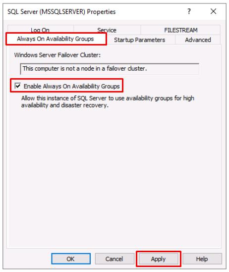

1. Select **OK** on the **Warning** dialog. Keep the **Properties** window open.


## 06: Enable startup trace flags

To optimize the performance of your link, it's recommended to enable the following trace flags at startup:

- **-T1800**: This trace flag optimizes performance when the log files for the primary and secondary replicas in an availability group are hosted on disks with different sector sizes, such as 512 bytes and 4 KB. If both primary and secondary replicas have a disk sector size of 4 KB, this trace flag isn't required. 
    
    {: .important }
    > For more information, see [KB3009974](https://support.microsoft.com/en-us/topic/kb3009974-fix-slow-synchronization-when-disks-have-different-sector-sizes-for-primary-and-secondary-replica-log-files-in-sql-server-ag-and-logshipping-environments-ed181bf3-ce80-b6d0-f268-34135711043c).

- **-T9567**: This trace flag enables compression of the data stream for availability groups during automatic seeding. The compression increases the load on the processor but can significantly reduce transfer time during seeding.

---

1. Select the **Startup Parameters** tab.

1. Enter `-T1800`, then select **Add**.

1. Enter `-T9567`, then select **Add**.

    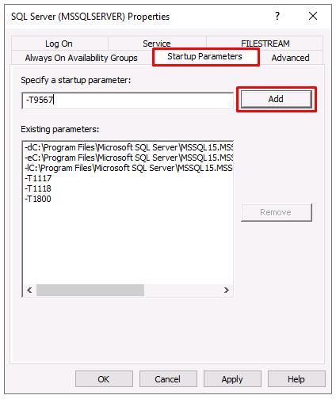

1. Select **OK**, then select **OK** on the **Warning** dialog.

1. Restart SQL Server by right-clicking **SQL Server (MSSQLSERVER)**, then select **Restart**.

    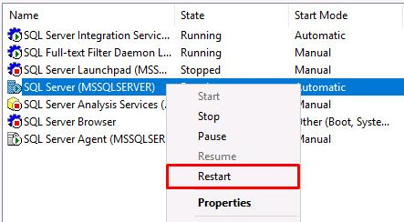

{: .important } 
> For more information, see the [syntax to enable trace flags](https://learn.microsoft.com/en-us/sql/t-sql/database-console-commands/dbcc-traceon-transact-sql?view=sql-server-ver16).


## 07: Validate the configuration

1. Go back to your open **SQL Server Management Studio** window.

1. Replace your previous query for setting the master key with the following:

    ```
    -- Shows if the Always On availability groups feature is enabled
    SELECT SERVERPROPERTY ('IsHadrEnabled') as 'Always On enabled (1 true, 0 false)';
    GO
    -- Lists all trace flags enabled on SQL Server
    DBCC TRACESTATUS;
    ```

1. Select **Execute** on the top toolbar.

    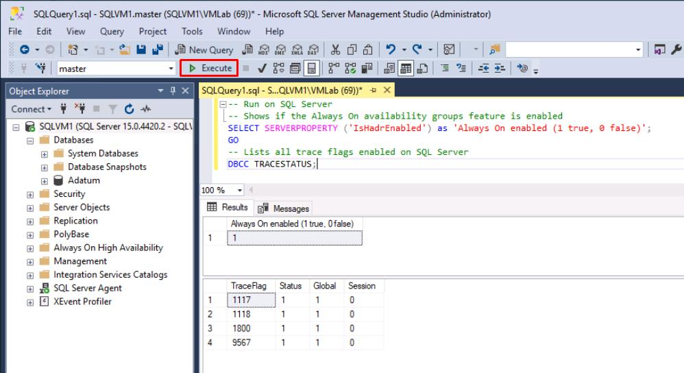

    {: .note }
    > **Always On enabled** should be **1**.
    > 
    >**1800** and **9567** should be listed.
    >
    > If not, restart SQL Server again from SQL Server Configuration Manager.

---

**Congratulations!** You've successfully completed this task.


## Task 02: Configure network connectivity

## Introduction

Ensuring robust network connectivity is essential for Adatum Corporation to maintain high availability and disaster recovery for their eBook store, Adatum Books. To prevent disruptions to their eBook shopping services, they seek to implement a solution that ensures seamless network connectivity between their on-premises SQL VM and Azure SQL Managed Instance.

## Description

In this task, you'll configure network security settings, open required firewall ports, and test connectivity between SQL Server and the Azure SQL Managed Instance.

The Azure SQL Server VM is within the same virtual network as the targeted Managed Instance in this scenario.

## Success criteria

-   You configured the network security settings and opened the required firewall ports.
-   You tested and confirmed connectivity between SQL Server and the Azure SQL Managed Instance.
-   You ensured the Azure SQL Server VM is within the same virtual network as the targeted Managed Instance.

## Learning resources

-   Configure network security settings
-   [Test connectivity between SQL Server and the Azure SQL Managed Instance](https://learn.microsoft.com/en-us/troubleshoot/sql/database-engine/connect/test-oledb-connectivity-use-udl-file)

***

**SQL Server on Azure Virtual Machines**

For the link to work, you must have network connectivity between SQL Server and Managed Instance. The network option that you choose depends on whether or not your SQL Server instance is on an Azure network.

Deploying SQL Server on Azure Virtual Machines in the same Azure virtual network that hosts SQL Managed Instance is the simplest method, because network connectivity will automatically exist between the two instances.

>   [!knowledge] For more information, see [Quickstart: Configure an Azure VM to connect to Azure SQL Managed Instance](https://learn.microsoft.com/en-us/azure/azure-sql/managed-instance/connect-vm-instance-configure?view=azuresql).

***

**Different virtual network**

If your SQL Server on Azure Virtual Machines instance is in a different virtual network from your managed instance, you need to make a connection between both virtual networks. The virtual networks don't have to be in the same subscription for this scenario to work.

There are two options for connecting virtual networks:

-   [Azure virtual network peering](https://learn.microsoft.com/en-us/azure/virtual-network/virtual-network-peering-overview)
-   VNet-to-VNet VPN gateway ([Azure portal](https://learn.microsoft.com/en-us/azure/vpn-gateway/vpn-gateway-howto-vnet-vnet-resource-manager-portal), [PowerShell](https://learn.microsoft.com/en-us/azure/vpn-gateway/vpn-gateway-vnet-vnet-rm-ps), [Azure CLI](https://learn.microsoft.com/en-us/azure/vpn-gateway/vpn-gateway-howto-vnet-vnet-cli))

Peering is preferable because it uses the Microsoft backbone network, so from the connectivity perspective, there's no noticeable difference in latency between virtual machines in a peered virtual network and in the same virtual network.

Virtual network peering is supported between networks in the same region. Global virtual network peering is supported for instances hosted in subnets created after September 22, 2020.

>   [!knowledge] For more information, see [Frequently asked questions (FAQ)](https://learn.microsoft.com/en-us/azure/azure-sql/managed-instance/frequently-asked-questions-faq?view=azuresql#does-sql-managed-instance-support-global-vnet-peering).

***

**SQL Server outside Azure**

If your SQL Server instance is hosted outside Azure, establish a VPN connection between SQL Server and SQL Managed Instance by using either of these options:

-   [Site-to-site VPN connection](https://learn.microsoft.com/en-us/microsoft-365/enterprise/connect-an-on-premises-network-to-a-microsoft-azure-virtual-network?view=o365-worldwide)
-   [Azure ExpressRoute connection](https://learn.microsoft.com/en-us/azure/expressroute/expressroute-introduction)

>   [!hint] ExpressRoute is recommended for the best network performance when you're replicating data. Provision a gateway with enough bandwidth for your use case.


## 01: Network ports between the environments

Regardless of the connectivity mechanism, there are requirements that must be met for the network traffic to flow between the environments. 

In this task, you'll open ports in Windows Firewall on the SQL VM, then configure ports on the Network Security Group (NSG) attached to the Managed Instance.

---

### Open ports on the Windows Firewall

1. On the Azure SQL VM, **SQLVM1**, select the Windows start menu, then enter and select **`Windows Powershell`**.

1. Enter the following to open the inbound and outbound ports needed, by creating new firewall rules:

    ```
    # Inbound rule: Allow TCP port 5022 (any source IP)
    New-NetFirewallRule -DisplayName "Allow TCP port 5022 inbound" -Direction Inbound -Profile Any -Action Allow -LocalPort 5022 -Protocol TCP

    # Outbound rule: Allow TCP port 5022 (any destination IP)
    New-NetFirewallRule -DisplayName "Allow TCP port 5022 outbound" -Direction Outbound -Profile Any -Action Allow -LocalPort 5022 -Protocol TCP

    # Outbound rule: Allow TCP port range 11000-11999 (any destination IP)
    New-NetFirewallRule -DisplayName "Allow TCP ports 11000-11999 outbound" -Direction Outbound -Profile Any -Action Allow -LocalPort 11000-11999 -Protocol TCP
    ```

    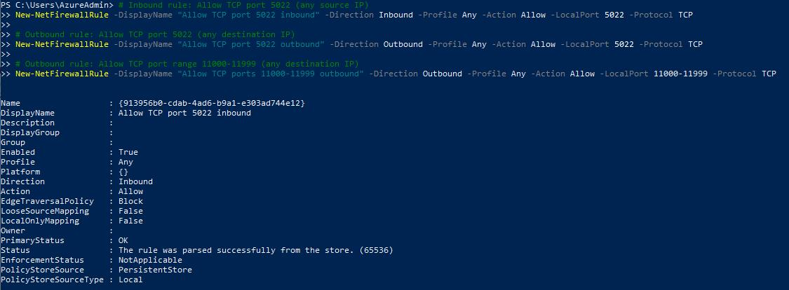

1. Select the minimize button on the VM's top control bar.

    

---

### Open ports on the Managed Instance NSG

You'll now set up the inbound and outbound security rules for the network security group attached to the Managed Instance.

1. On the tab for **SQLVM1** in Azure, select the **ResourceGroup1** breadcrumb link in the upper left.

    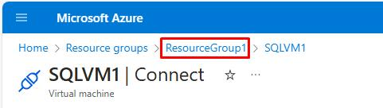

1. Select the Managed Instance network security group, **SQLMI-@lab.Variable(miName)-NSG**.

    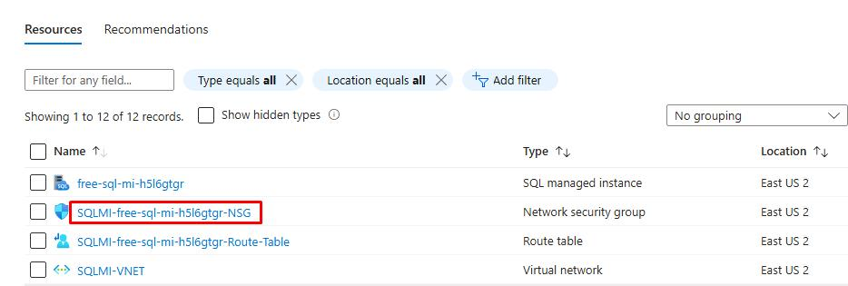

1. On the left service menu, select **Settings**, then select **Inbound security rules**.

    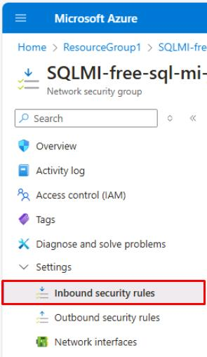

1. Select **Add** at the top.

    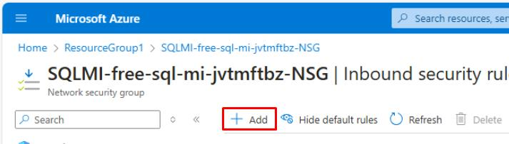

1. Use the following information on the **Add inbound security rule** pane:

    | Item | Value |
    |:--------|:--------|
    | Destination port ranges   | **`5022,11000-11999`**   |
    | Protocol   | **TCP**   |
    | Priority  | **`200`**   |
    | Name | **`AllowSqlLinkInbound`**  |

1. Select **Add** at the bottom of the pane.

    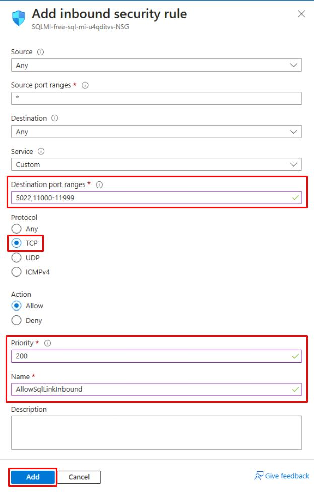

1. Select **Outbound security rules** on the left service menu.

1. Select **Add** at the top.

1. Use the following information on the **Add outbound security rule** pane:

    | Item | Value |
    |:--------|:--------|
    | Destination port ranges   | **`5022,11000-11999`**   |
	| Protocol   | **TCP**   |
    | Priority  | **`200`**   |
    | Name | **`AllowSqlLinkOutbound`**  |

1. Select **Add** at the bottom of the pane.

    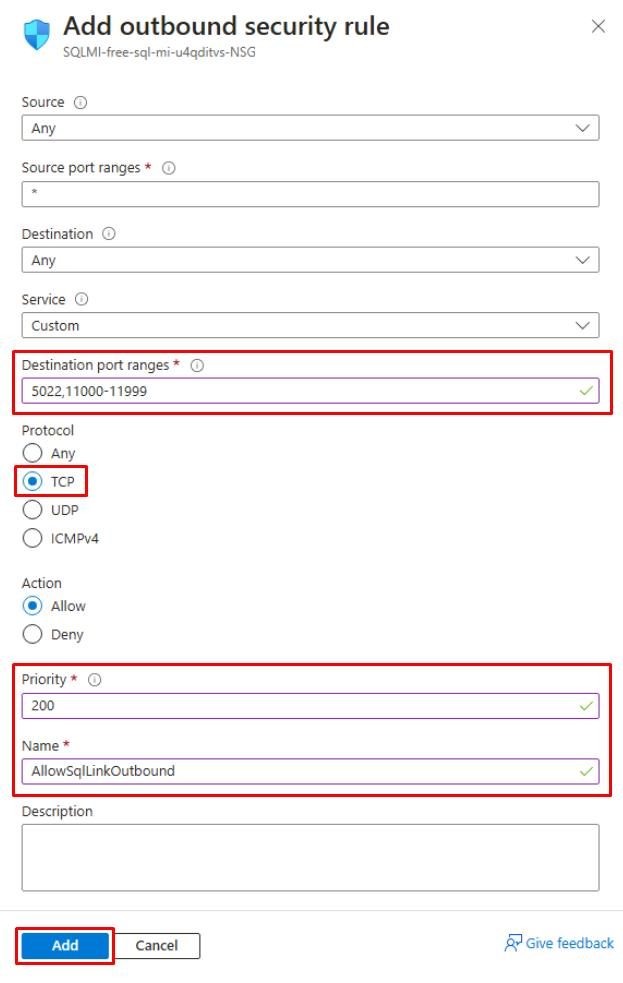

---

{: .important } 
> #### Knowledge 
>- Ports need to be open in every firewall in the networking environment, including the host server, as well as any corporate firewalls or gateways on the network. In corporate environments, you might need to show your network administrator the information to help open additional ports in the networking layer.
>- While you can choose to customize the endpoint on the SQL Server side, the port numbers for a SQL Managed Instance cannot be changed or customized.
>- IP address ranges of subnets hosting Managed Instances and SQL Servers must not overlap.


## 02: Testing network connectivity using SSMS

Bidirectional network connectivity between SQL Server and SQL Managed Instance is necessary for the link to work. After you open ports on the SQL Server side and configure an NSG rule on the SQL Managed Instance side, you can test connectivity by using SQL Server Management Studio (SSMS). 

{: .important } 
> When you use **Network Checker** in SSMS, this automatically creates a temporary SQL Agent job on both SQL Server and the Managed Instance to check the connection. This job is then deleted after the test is finished. 
>
> You can alternatively use Transact-SQL, but you'd need to manually delete the SQL Agent job upon completion.

---

### Retrieve the host name of the Managed Instance from Azure

1. Switch to your other tab to check on the deployment of the Managed Instance.

    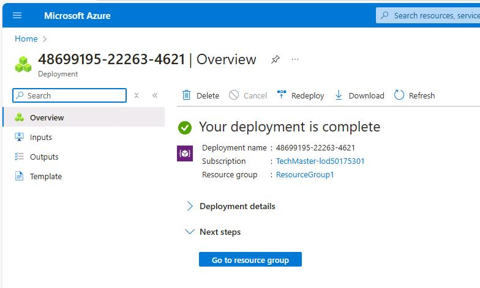

1. If completed, select **Go to resource group**.

    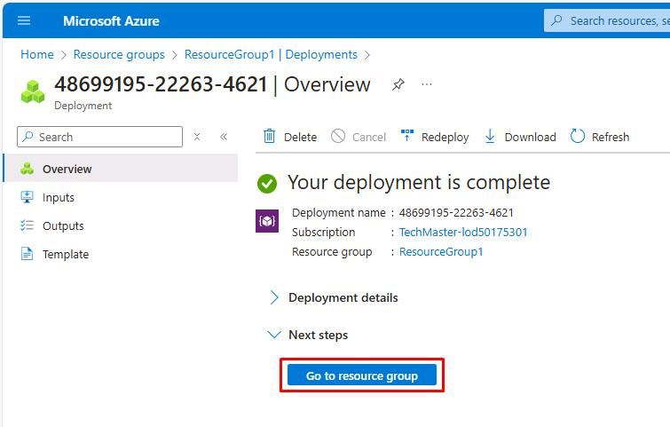

1. Select the **@lab.Variable(miName)** SQL managed instance.

    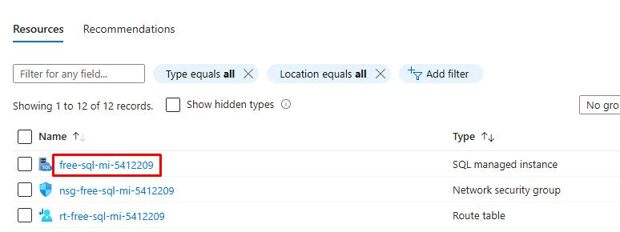

1. Under the **Essentials** section, copy and paste the value for **Host** in the text box below, for future use throughout this lab.

    @lab.TextBox(miHost)

    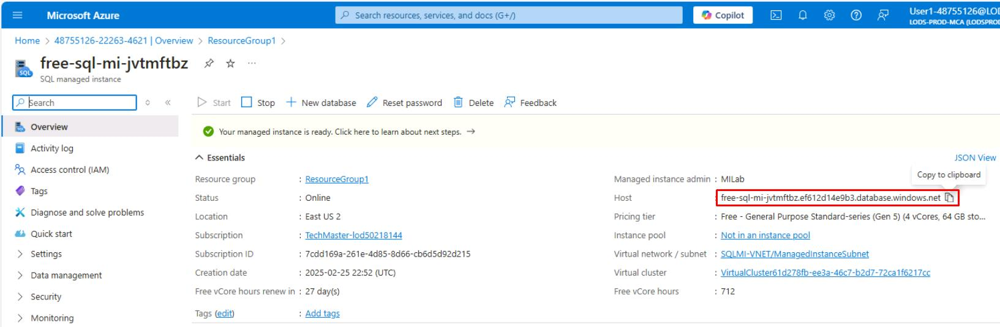

1. On the Windows task bar, reopen **SQLVM1** to return to the Azure VM.

1. If needed, sign back in using **+++@lab.Variable(azurePw)+++**.

---

### Test the connection

1. In SQL Server Management Studio's **Object Explorer** pane on the left, expand **Databases**.

1. Right-click the **Adatum** database, select **Azure SQL Managed Instance link**, then select **Test Connection...**

    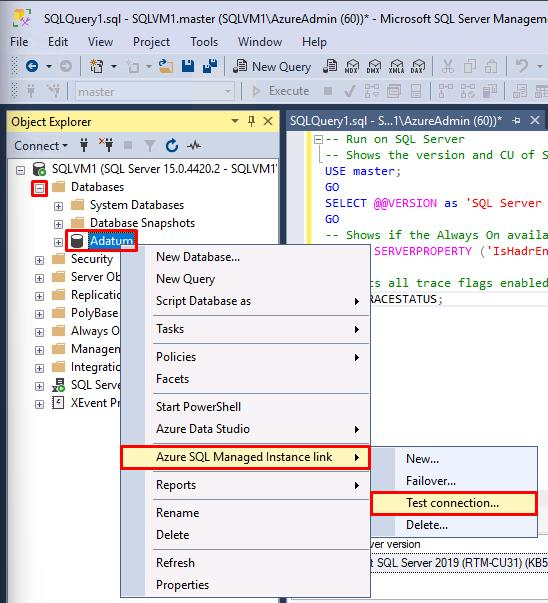

1. On the Introduction page, select **Next**.

1. All **Prerequisites** should be met. Select **Next**.

1. Select **Login**, under **Login to SQL Managed Instance**.

1. Enter the following in the **Connect to Server** window:

    | Item | Value |
    |:--------|:--------|
    | Server name   | **`@lab.Variable(miHost)`**   |
    | Authentication   | **SQL Server Authentication**   |
    | Login  | **`MILab`**   |
    | Password  | **`@lab.Variable(azurePw)`**   |

1. Select the checkboxes for **Remember password** and **Trust server certificate**, then select **Connect**.

    

    {: .warning }
    > If you have issues connecting, the **Server name** value in the instructions is taken from the text box entry for the **Host** value retrieved from Azure. Correct the value in the text box in the earlier step, as it will continue to be referenced in the instructions.

1. Select **Next**.

    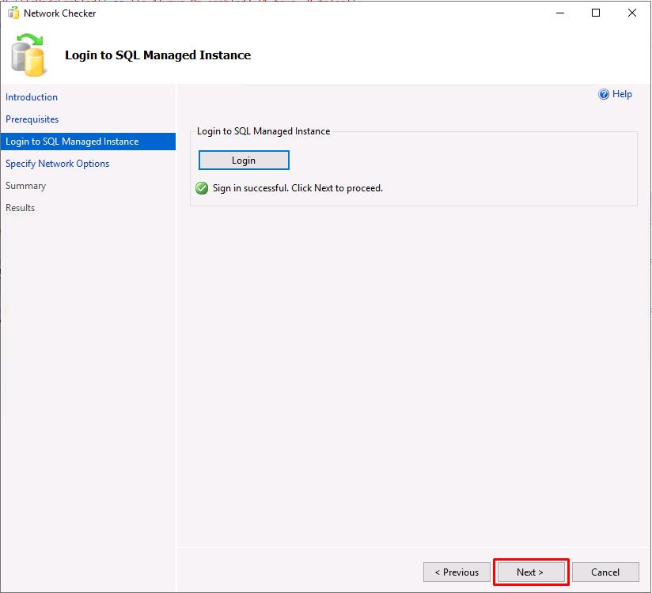

1. Enter **`SQLMIEndpoint`** for the **Endpoint name**, then select **Next**.

    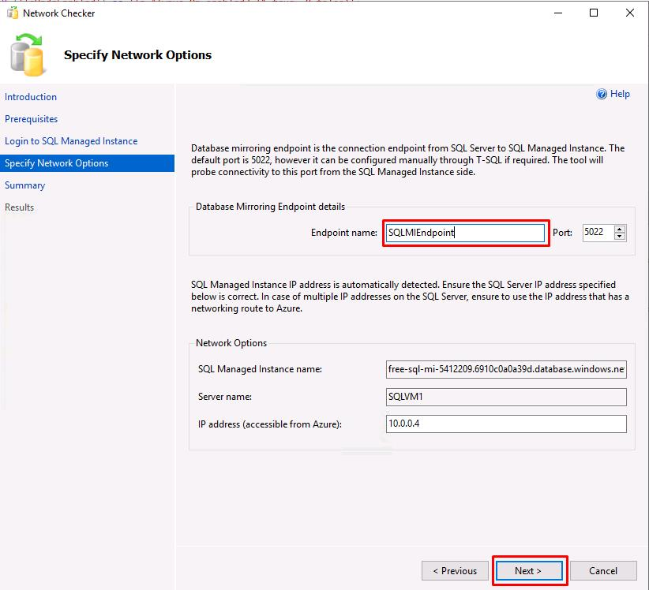

1. On the **Summary** page, select **Finish** to run the test.

1. All tests should show **Success**. Select **Close**.

    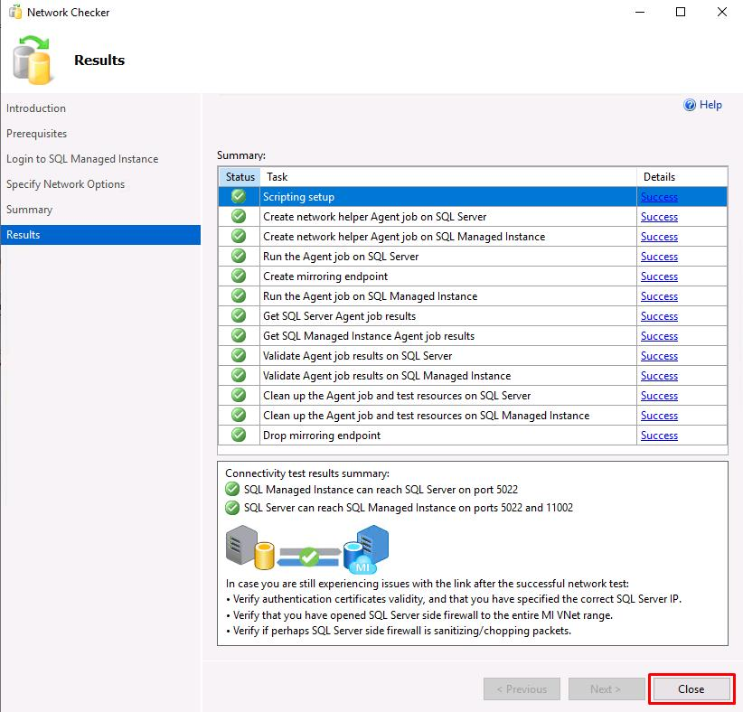

---

**Congratulations!** You've successfully completed this task.


This phase is crucial for reconciling any data accuracy issues, verifying completeness, and addressing performance issues with the workload.

For more details, review the [Post-migration](https://learn.microsoft.com/en-us/data-migration/sql-server/managed-instance/guide?view=azuresql#post-migration) section of the migration guide.

