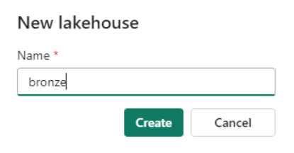

---

title: 'Task 02: Create Lakehouses'

layout: default

nav_order: 2

parent: 'Exercise 02: Create a Fabric workspace and data pipeline'

---

### Task 02: Create Lakehouses

Now, let's see how each department in Contoso can easily create a Lakehouse in their workspace without any provisioning by simply providing the name, given the proper access rights, of course!

1. In the lower left of the navigation pane, select **Power BI**. Then, in the **Synapse** section, select **Data Engineering**. 

    

    {: .note }
    > Selecting **Data Engineering** switches the context from reports and visualizations to data engineering. 
    >
    > You should see that the options presented in the left menu pane change to reflect the change in context.

1. On the Synapse Data Engineering Home page, select the **Lakehouse** tile.

1. In the **Name** box, enter **bronze** and then select **Create**. The context switches to the bronze page.

    

1. In the lower left of the navigation pane for the bronze page, select **Data Engineering**. 

1. In the **Synapse** section, select **Data Engineering** to return to the Synapse Data Engineering Home page. 

    {: .note }
    >This step switches the context from the bronze Lakehouse back to the workspace.

1. Repeat steps 2-5 to create two more Lakehouses. Use the following names for the new Lakehouses:

    | Lakehouse Name |
    |:---------|
    - **silver**
    - **gold**   

1. In the left menu pane for the Synapse Data Engineering Home page, select **ContosoSales@lab.LabInstance.Id**. You should see the three Lakehouses and related objects listed.

    

{: .important } 
>Now you’re ready to start data ingestion. You’ll first ingest the raw data in the bronze layer. After that, you’ll curate and enrich the data as you move the data to the silver and then gold layer.

